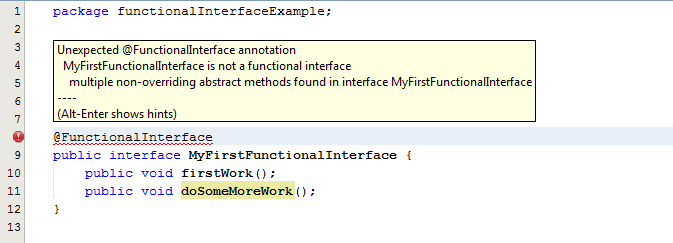

# 1. lambda表达式

> 精简自 ： https://howtodoinjava.com/java8/complete-lambda-expressions-tutorial-in-java/


在 Java 8 发布 （2014.03.18th）前的 2 年， 并没新增多少激动人心的 特性。Java 在过去十年里， 只是陆续新增了少数的 `并发类`、`泛型` 及 `注解` 。

Only few concurrent classes, generics and if you agree then annotations as well, are remarkable additions in java in last decade. 

`Lambda 表达式` 就好比是 久旱逢甘霖。

Lambda expressions break this drought and feels like a pleasant gift.

本篇将从 三部分介绍 lambda 表达式：

1. 什么是 java 中的 lambda 表达式？
2. 什么是 functional interface ？
3. lambda 表达式的几个示例。


## 1.  java 中的 lambda 表达式（λ）是什么？ 

Lambda 表达式(或函数)是一个匿名函数,即:**没有名字,没有函数标识符**。

In programming, a Lambda expression (or function) is just an anonymous function, i.e.

> 换句话说, lambda 表达式是**无名的函数作为常量值**,写在有需要的地方,**通常作为其他函数的一个参数**。
>
> In other words, lambda expressions are nameless functions given as constant values, and written exactly in the place where it’s needed, 
> typically as a parameter to some other function.

Lambda 表达式的最重要的特征是,**在它们出现的上下文中执行**。所以,类似的 lambda 表达式可以 以不同的方式 执行在其他上下文(即 逻辑相同，但根据传递给函数的不同的参数，结果将不同 )。

> **λ 为什么激动人心** ?  很明显, λ 是某种 没有 名称 和标识符 的 函数。
> - 答案在于  函数式编程（functional programming）的好处 对比 面向对象的编程(object oriented programming，OOP)。
>
> - 大多数 OOP 语言 只把 `objects ` 和 `instances ` 作为一等公民，方法（函数、功能）需要依赖于 一等公民。尤其适用于 Java，方法 不能定义在一个 `object` 外部。
>
>   Most OOP languages evolve around objects and instances and treat only them their first class citizens. Another important entity i.e. functions take back seat. 
>
>   This is specially true in java, where functions can’t 
>   exist outside an object. A function itself does not mean anything in java, until it is related to some object or instance.
>
> -  但在函数式编程中,你可以定义函数,赋值给实参变量,将他们作为方法参数等等。JavaScript是一个很好的例子,您可以通过回调方法如 Ajax 调用。这是非常有用的功能,从 java 8 开始,我们也可以使用这些 lambda 表达式。
>
>   But in functional programming, you can define functions, give them reference variables and pass them as method arguments and much more. 
>   JavaScript is a good example of this where you can pass callback methods e.g. to Ajax calls. It’s very useful feature and has been lacking in java from beginning. Now with java 8, we can also use these lambda expressions.


语法:  lambda 表达式的基本语法

```java
(parameters) -> expression

(parameters) -> { statements; }

() -> expression
```


让我们看看一些例子:

```java
(int a, int b) ->    a * b           // 2.【显式声明参数类型】 接受 int 类型，返回 两数乘机
(a, b)          ->   a - b           // 2.【上下文推断参数类型】 接受 number 类型，返回两数差
() -> 99                             // 3.无参，返回 99
(String a) -> System.out.println(a)  // 【显式声明参数类型】 打印，and returns nothing
a -> 2 * a                           // 4.takes a number and returns the result of doubling it

c -> { 
  //some complex statements
  // return sth if needed.
}   // takes a collection and do some procesing
```


让我们找出一些规则将帮助我们在写作lambda表达式:

1. lambda表达式可以有零个、一个或多个参数。

2. 可以显式声明参数的类型，也可以从上下文推断参数的类型

3. 多个参数必须包含在括号中，并用逗号分隔，空括号用于表示零个参数

4. 当只有一个参数时，如果推断它的类型，可以不使用括号。如 `a -> return a * a`

5. lambda表达式的函数体可以包含零个，一个或多个语句。

   The body of the lambda expressions can contain zero, one or more statements.

6. 如果lambda表达式的**函数体只有一行，则可以不用大括号，同时，该语句的结果作为返回值**。

7. 当lambda表达式的函数体中大于一行代码，则这些语句必须包含在大括号中。

   If body of lambda expression has single statement curly brackets are not  mandatory and the return type of the anonymous function is the same as  that of the body expression. When there is more than one statement in body than these must be enclosed in curly brackets.


在深入了解 lambda expressions 和 Java 编程 之前， 我们需要先了解 `函数式接口`（`functional interface`）。


## 2. `函数式接口`（`functional interface`）

`Functional Interface` 也被称为单一抽象方法的接口（Single Abstract Method interfaces ，SAM接口）。就像它的名字一样，它 **只能有一个抽象方法** 。

在 Java8 种引入了一个注解 `@FunctionalInterface` , 用来标识单一责任的规则。

当你在某个接口使用了该注解，接口违反了 `函数式接口`的规定时 (**如错误地添加了第二个接口方法**)，会产生编译报错。

例如,新Runnable接口的定义是这样的:

```java
@FunctionalInterface
public interface Runnable {
    public abstract void run();
}
```

一个函数式接口的示例：

```java
@FunctionalInterface
public interface MyFirstFunctionalInterface {
    public void firstWork();
}
```

请注意，**即使省略 `@FunctionalInterface` 注解，函数式接口也是有效的**。它仅用于 **通知 编译器 在接口内 强制 定义 单个 抽象方法**。




此外，由于默认方法不是抽象的，您可以随意添加默认方法到你的接口中，只要你喜欢。

另一个要记住的要点是，如果一个接口中定义的函数是重写了 `Object` 类的方法，
那么这个方法不会被计入接口的抽象方法，因为接口的任何实现类都会继承自 `Object`。
例如，下面是完全有效的函数式接口。

```java
@FunctionalInterface
public interface MyFirstFunctionalInterface{

    public void firstWork();

    @Override
    public String toString();                 //重写toString

    @Override
    public boolean equals(Object obj);        //重写equals
}
```


